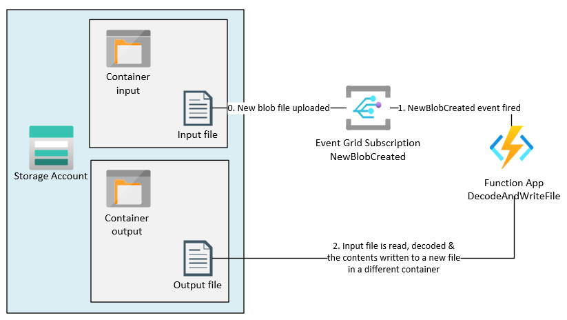

# blob-event-func

This repo shows how to write an [Azure Function](https://docs.microsoft.com/en-us/azure/azure-functions/functions-overview) that responds to a `NewBlobCreated` event from [Azure Blob Storage](https://docs.microsoft.com/en-us/azure/storage/blobs/storage-blobs-overview), decodes an encoded field in the file and writes the results to a new blob file in a different container.



In this example, any blob file that is dropped into the `input` container will fire an [Azure Blob Storage - Event Grid](https://docs.microsoft.com/en-us/azure/azure-functions/functions-bindings-event-grid?tabs=in-process%2Cextensionv3&pivots=programming-language-csharp) `NewBlobCreated` event. This is similar to if an IoT device was writing new files to a storage account. This IoT device encodes its data in one of the fields of the blob file using [base64 encoding](https://en.wikipedia.org/wiki/Base64). The downstream code of an overall solution expects the JSON files that are in the storage account to be plain text. Therefore, we need to inject an Azure Function in the middle of the process to decode the base64 encoded data and write out a new "plaintext" JSON file that can be read by downstream processes.

In the `src/DecodeAndWriteFile.cs` file, the `Run` method is decorated with the `Function("DecodeAndWriteFile")` attribute. This defines an endpoint that the Event Grid trigger will be linked to.

```csharp
[Function("DecodeAndWriteFile")]
public async Task Run([EventGridTrigger] BlobCreatedEvent input)
```

This linkage is created declaratively in the `infra/eventSubscription.bicep` file.

```bicep
resource newBlobCreatedEventSubscription 'Microsoft.EventGrid/systemTopics/eventSubscriptions@2021-06-01-preview' = {
  name: '${blobCreatedEventGridTopic.name}/newBlobCreatedForRaiseEventFunctionAppEventSubscription'
  properties: {
    destination: {
      endpointType: 'AzureFunction'
      properties: {
        resourceId: '${functionApp.id}/functions/DecodeAndWriteFile'
```

## Disclaimer

**THE SOFTWARE IS PROVIDED "AS IS", WITHOUT WARRANTY OF ANY KIND, EXPRESS OR IMPLIED, INCLUDING BUT NOT LIMITED TO THE WARRANTIES OF MERCHANTABILITY, FITNESS FOR A PARTICULAR PURPOSE AND NONINFRINGEMENT. IN NO EVENT SHALL THE AUTHORS OR COPYRIGHT HOLDERS BE LIABLE FOR ANY CLAIM, DAMAGES OR OTHER LIABILITY, WHETHER IN AN ACTION OF CONTRACT, TORT OR OTHERWISE, ARISING FROM, OUT OF OR IN CONNECTION WITH THE SOFTWARE OR THE USE OR OTHER DEALINGS IN THE SOFTWARE.**

## Prerequisites

- [Azure CLI](https://docs.microsoft.com/en-us/cli/azure/install-azure-cli)
- [.NET Core 6](https://docs.microsoft.com/en-us/dotnet/core/install/default-install-netcore)
- Azure subscription & resource group
- The ability to assign RBAC permissions to the managed identity so it can read & write blob files from the Storage Account

## Deployment

1.  Modify the `infra/env/dev.parameters.json` file as needed for your environment.

1.  Run the following Azure CLI code to deploy the initial Azure resources (modify the resource group as needed).

    ```shell
    az deployment group create --resource-group rg-blobEventFunc-ussc-dev --template-file ./infra/init/main.bicep --parameters ./infra/env/dev.parameters.json
    ```

1.  Compile & package the Azure Function locally.

    ```shell
    dotnet publish --configuration Release ./src

    Compress-Archive ./src/bin/Release/net6.0/publish/* ./app.zip -Update
    ```

1.  Deploy the Azure Function code (with endpoint) to Azure (modify the resource group & function name as needed).

    ```shell
    az functionapp deployment source config-zip -g rg-blobEventFunc-ussc-dev -n func-blobEventFunc-ussc-dev --src ./app.zip
    ```

1.  Run the following Azure CLI code to deploy the Event Grid subscription (you can't set up the binding until the Azure Function code is deployed because the endpoint won't exist) (modify the resource group as needed).

    ```shell
    az deployment group create --resource-group rg-blobEventFunc-ussc-dev --template-file ./infra/eventSubscription/main.bicep --parameters ./infra/env/dev.parameters.json
    ```

## Run the code

1.  Take the sample data in the `./src/sampleData/data.json` file and upload it to your Azure blob storage account, in the `input` container.

    

1.  Wait a few seconds, then look in the `output` container to see the new decoded data file.

    

## Links

- [Azure Functions](https://docs.microsoft.com/en-us/azure/azure-functions/functions-overview)
- [Azure Functions - Event Grid](https://docs.microsoft.com/en-us/azure/azure-functions/functions-bindings-event-grid?tabs=in-process%2Cextensionv3&pivots=programming-language-csharp)
- [Azure Blob Storage](https://docs.microsoft.com/en-us/azure/storage/blobs/storage-blobs-overview)
- [base64 encoding](https://en.wikipedia.org/wiki/Base64)
